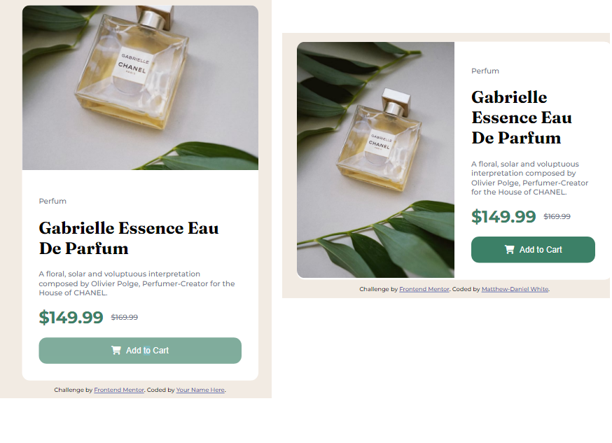

# Frontend Mentor - Product preview card component solution

This is a solution to the [Product preview card component challenge on Frontend Mentor](https://www.frontendmentor.io/challenges/product-preview-card-component-GO7UmttRfa). Frontend Mentor challenges help you improve your coding skills by building realistic projects.

## Table of contents

- [Overview](#overview)
  - [The challenge](#the-challenge)
  - [Screenshot](#screenshot)
  - [Links](#links)
- [My process](#my-process)
  - [Built with](#built-with)
  - [What I learned](#what-i-learned)
  - [Continued development](#continued-development)
  - [Useful resources](#useful-resources)
- [Author](#author)
- [Acknowledgments](#acknowledgments)

**Note: Delete this note and update the table of contents based on what sections you keep.**

## Overview

### The challenge

Create a preview card for a product according to the design given.

Users should be able to:

- View the optimal layout depending on their device's screen size
- See hover and focus states for interactive elements

### Screenshot



### Links

- Solution URL: https://github.com/PersianBlue/Product-Preview-Card

- Live Site URL: html {
  display: flex;
  align-items: center;
  min-height: 100%;
  text-align: center;
}

body {
  margin: 0 auto;
  min-height: 100%;
  background: var(--cream);
  font-family: "Montserrat";
}

## My process

Created the html structure first, then added in the styles from top to bottom, outsde in. Started with the design for mobile first, then added in media queries to handle desktop. As Kevin Powell always says, websites are responsive by default, it's us who make them not responsive by things we add, especially when we embrace a desktop-first design.
Took about 1 hour to create.

### Built with

- Semantic HTML5 markup
- CSS custom properties
- Flexbox
- Mobile-first workflow

### What I learned

Learned how to centre an element horizontally (margin auto) and vertically. Set the parent container to display flex, and then set align-items to center.
Also learned how to center something in the middle of the entire page, by making sure the html and body tags took up the entire screen first.

```css
html {
  display: flex;
  align-items: center;
  min-height: 100%;
  text-align: center;
}

body {
  margin: 0 auto;
  min-height: 100%;
}
```

### Continued development

I aim to be able to make beautiful, fast, responsive websites with a great user experience.
